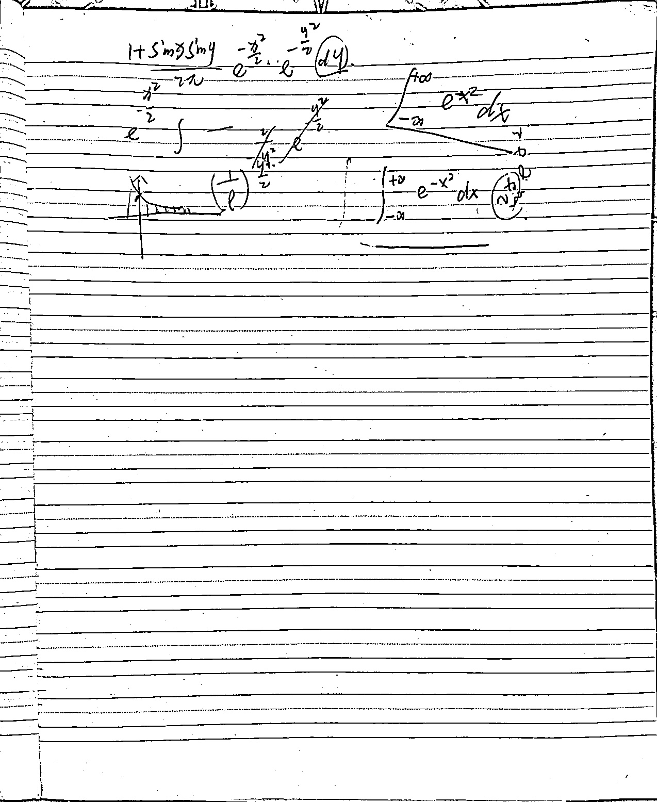
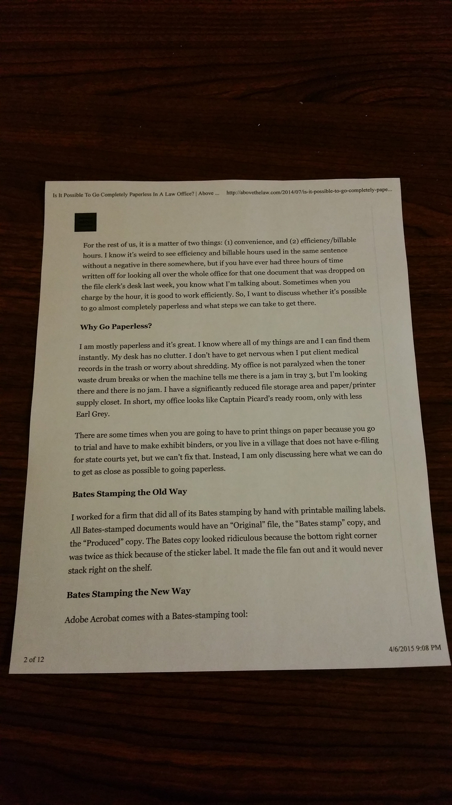
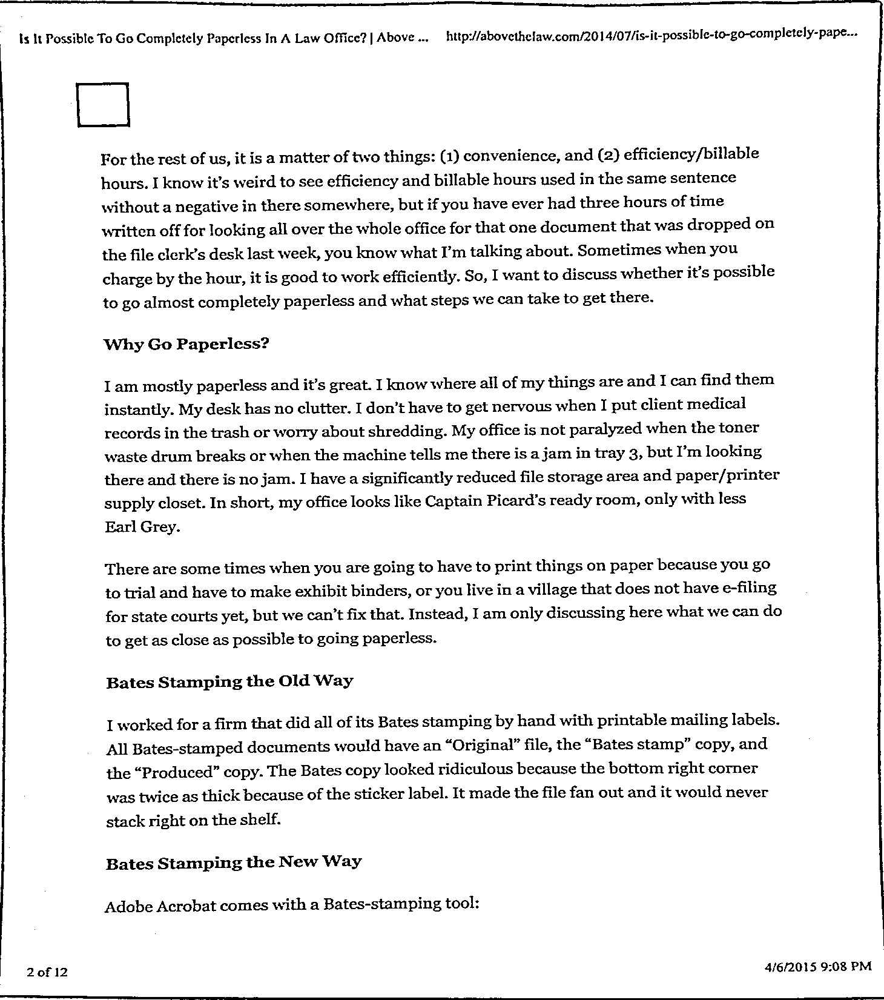
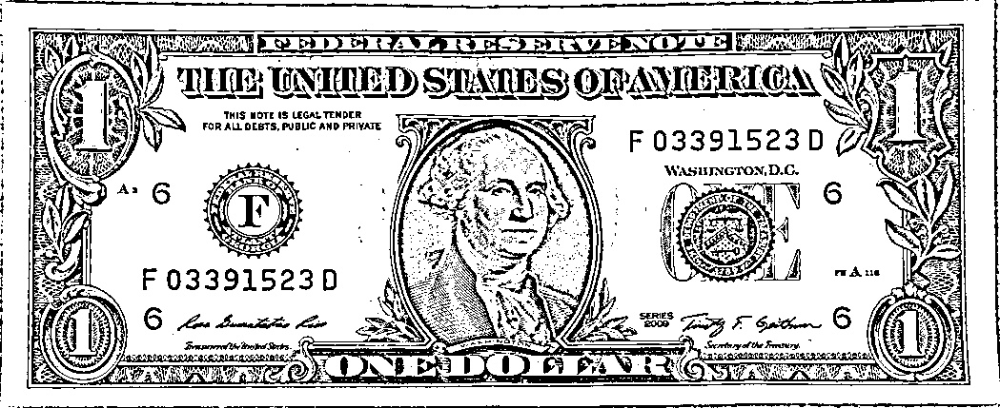
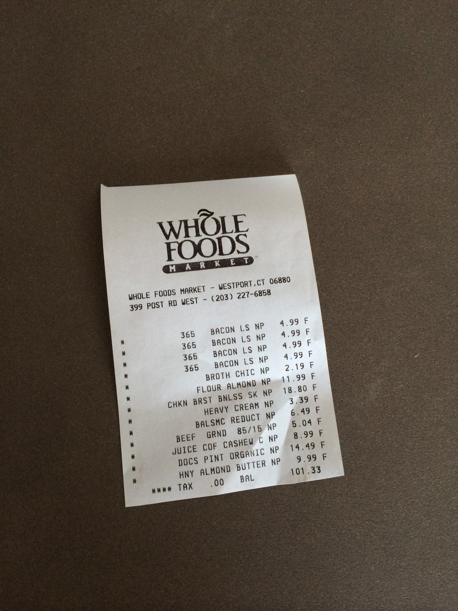

# Document Scanner

这是一个基于Paddle的扫描全能王，它的检测步骤主要分为两步：
1. 进行图像分割，提取出文本所在的位置
2. 根据分割结果提取四个角点并进行后处理

## 环境
### 安装环境

```shell
pip install -r requirements.txt
```
### 下载model

从release中下载模型，并放到项目根目录下

### 运行

运行demo.py, 修改图片路径后运行

```python
# demo.py
from predict import *

result = predict_one_image('images/IMG_0817.JPG')
cv2.imwrite('./output.jpg', result)
result = cv2.cvtColor(result, cv2.COLOR_BGR2RGB)
show(result)
```

## 效果图










